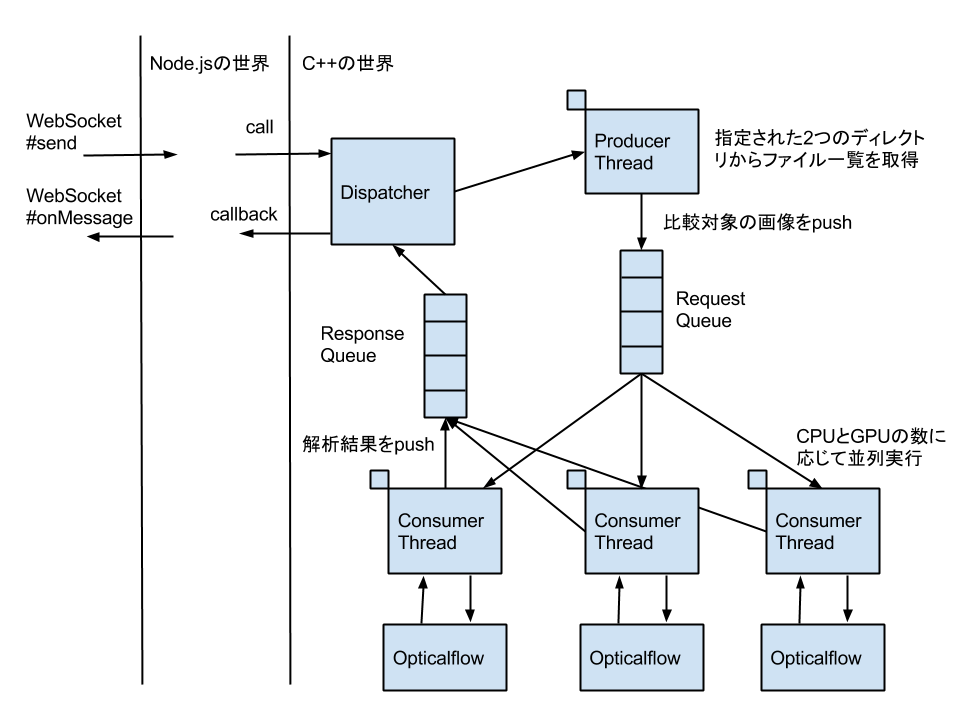
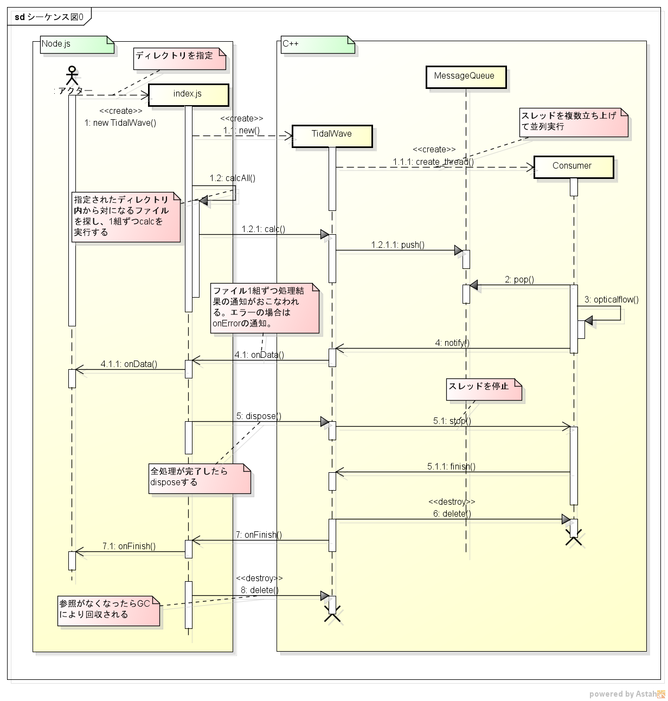

# tidal-wave 

並列実行で小さなflowをたくさんつくり、大きな津波を発生させるWebサービス。

防波堤(しきい値)が低いと高波にのまれてしまうので注意。

## なにするもの？

## 必要なもの

### 必須

Windowsでは動かないよ。

* node.js 0.10.x
    * node-gyp
* OpenCV 2.4.x
    * cmake

### オプション

* cuda-6.0
    * gcc-4.6
    * 最新のgccだとcudaが対応していないので古いもの。
    * Distributionによって使えるgccのバージョンが異なるので注意。以下を参照。
    * http://docs.nvidia.com/cuda/cuda-getting-started-guide-for-linux/#abstract
    * Ubuntu 14.04は未対応。
* CUDAに対応したNVIDIA製のグラフィックボード
    * https://developer.nvidia.com/cuda-gpus

CUDAを利用するとGPUを利用してより高速に処理がおこなえるようになります

## 環境構築方法

### CUDAを利用しない場合

#### OpenCVのインストール

~~~
$ sudo apt-get install cmake pkg-confg libopencv-dev
~~~

#### node-gypのインストール

~~~
$ npm install -g node-gyp
~~~

### CUDAを利用する場合

#### CUDAのインストール

* sudo apt-get install gcc g++

* 下記のサイトからcudaのインストーラをダウンロード
    * https://developer.nvidia.com/cuda-downloads
    * cuda_6.0.37_linux_64.run

* Xを停止する
    * Ctrl+Alt+F1でコンソールモードでログイン

~~~
sudo service lightdm stop
~~~

* cuda toolkitのインストール
    * 色々質問されるけど、基本全部y。ディレクトリはデフォルトのままで。
    
~~~
chmod +x cuda_6.0.37_linux_64.run
sudo ./cuda_6.0.37_linux_64.run
~~~

* パスを通す

~~~
export PATH=/usr/local/cuda-6.0/bin/:$PATH
export LD_LIBRARY_PATH=/usr/local/cuda-6.0/lib64/:$LD_LIBRARY_PATH
~~~

* Xを起動

~~~
sudo service lightdm start
~~~

* cudaのサンプルを動かしてみる

~~~
cd ~/NVIDIA_CUDA-6.0_Samples
cd 1_Utilities/deviceQuery
make
./deviceQuery
~~~

エラーが出ずにこんなのがでればOK

~~~
./deviceQuery Starting...

 CUDA Device Query (Runtime API) version (CUDART static linking)

Detected 1 CUDA Capable device(s)

Device 0: "GeForce 9400 GT"
  CUDA Driver Version / Runtime Version          6.0 / 6.0
  CUDA Capability Major/Minor version number:    1.1
  Total amount of global memory:                 512 MBytes (536543232 bytes)
  ( 2) Multiprocessors, (  8) CUDA Cores/MP:     16 CUDA Cores
  GPU Clock rate:                                1400 MHz (1.40 GHz)
  Memory Clock rate:                             400 Mhz
  Memory Bus Width:                              128-bit
  Maximum Texture Dimension Size (x,y,z)         1D=(8192), 2D=(65536, 32768), 3D=(2048, 2048, 2048)
  Maximum Layered 1D Texture Size, (num) layers  1D=(8192), 512 layers
  Maximum Layered 2D Texture Size, (num) layers  2D=(8192, 8192), 512 layers
  Total amount of constant memory:               65536 bytes
  Total amount of shared memory per block:       16384 bytes
  Total number of registers available per block: 8192
  Warp size:                                     32
  Maximum number of threads per multiprocessor:  768
  Maximum number of threads per block:           512
  Max dimension size of a thread block (x,y,z): (512, 512, 64)
  Max dimension size of a grid size    (x,y,z): (65535, 65535, 1)
  Maximum memory pitch:                          2147483647 bytes
  Texture alignment:                             256 bytes
  Concurrent copy and kernel execution:          Yes with 1 copy engine(s)
  Run time limit on kernels:                     Yes
  Integrated GPU sharing Host Memory:            No
  Support host page-locked memory mapping:       Yes
  Alignment requirement for Surfaces:            Yes
  Device has ECC support:                        Disabled
  Device supports Unified Addressing (UVA):      No
  Device PCI Bus ID / PCI location ID:           1 / 0
  Compute Mode:
     < Default (multiple host threads can use ::cudaSetDevice() with device simultaneously) >

deviceQuery, CUDA Driver = CUDART, CUDA Driver Version = 6.0, CUDA Runtime Version = 6.0, NumDevs = 1, Device0 = GeForce 9400 GT
Result = PASS
~~~

#### OpenCVのインストール

CUDAを有効にする必要があるので、ソースからビルドしなければならない。

Core i5 750で並列コンパイルしなかった場合、makeでだいたい4時間くらいかかる。

~~~
sudo apt-get install cmake
sudo apt-get install pkg-config
sudo ln -s /usr/lib/nvidia-current/libnvcuvid.so /usr/lib/libnvcuvid.so
~~~

* OpenCVのソースダウンロード
    * http://opencv.org/downloads.html
    * opencv-2.4.9.zip
* ビルド

~~~
unzip opencv-2.4.9.zip
cd opencv-2.4.9
cmake -DWITH_CUDA=ON -DWITH_TBB=ON -DBUILD_NEW_PYTHON_SUPPORT=ON -DWITH_V4L=ON -DINSTALL_C_EXAMPLES=ON -DINSTALL_PYTHON_EXAMPLES=ON -DBUILD_EXAMPLES=ON -DWITH_QT=OFF -DWITH_OPENGL=ON
make
sudo make install
~~~

* サンプルを動かしてみる

~~~
cp /usr/local/share/OpenCV/samples/gpu/farneback_optical_flow.cpp ./
g++ farneback_optical_flow.cpp `/usr/bin/pkg-config --cflags --libs opencv` -L/usr/local/cuda-6.0/lib64
./a.out -l hoge.png -r fuga.png
~~~

## 使い方

### ビルド

* CUDAを利用しない場合は、binding.gypのUSE_GPUを削除する

~~~
npm install
node-gyp configure
node-gyp build
~~~

### 実行

~~~
node index.js
~~~

## インタフェース

### リクエスト

* expect_path: 期待画像のディレクトリ
* target_path: 対象画像のディレクトリ
* options: オプション(省略可能)
    * threshold: しきい値(3〜5くらいが最適), デフォルト=5.0
    * span: ベクトルを取得する間隔, デフォルト=10
    * pyrScale: ピラミッド画像のスケール(<1), デフォルト=0.5
    * pyrLevels: ピラミッドの層の数, デフォルト=3
    * winSize: 平均化窓サイズ, デフォルト=30
    * pyrIterations: アルゴリズムの反復数, デフォルト=3
    * polyN: ピクセル近傍領域のサイズ, デフォルト=7
    * polySigma: ガウス分布の標準偏差, デフォルト=1.5
    * flags: 処理フラグ, デフォルト=256(ガウシアンフィルタの利用)

* オプティカルフローのパラメータの詳細は以下を参照のこと
    * http://opencv.jp/opencv-2svn/cpp/motion_analysis_and_object_tracking.html
 
~~~
{
  'expect_path': 'public/images',
  'target_path': 'public/images2',
  'options': {
    'threshold': 5.0,
    'span': 10,
    'pyrScale':0.5,
    'pyrLevels': 3,
    'winSize': 30,
    'pyrIterations': 3,
    'polyN': 7,
    'polySigma': 1.5,
    'flags': 256
  }
}
~~~

### レスポンス

* vector: ベクトルデータ
    * x: X座標
    * y: Y座標
    * dx: X方向の移動量
    * dy: Y方向の移動量
* expect_image: 期待画像
* target_image: 対象画像
* span: ベクトルを取得する間隔
* threshold: しきい値
* time: 処理にかかった時間
* status: ステータス（OK, SUSPICIOUS,ERRORの3つ）
* height: 画像の高さ
* width: 画像の幅

~~~
{
  vector: [
    { x: 60, y: 1160, dx: -0.7929320931434631, dy: 7.249414443969727 },
    { x: 70, y: 1160, dx: 2.1631455421447754, dy: 7.150839328765869 },
    { x: 80, y: 1160, dx: 3.28291392326355, dy: 6.485356330871582 }
  ],
  expect image: public/images/customjsp2.png,
  target image: public/images2/customjsp2.png,
  span: 10
  threshold: 5
  time: 2.4183433055877686
  status: SUSPICIOUS
}
~~~

